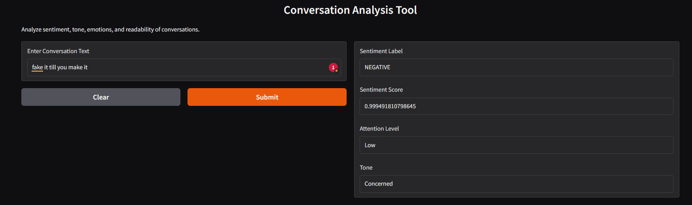
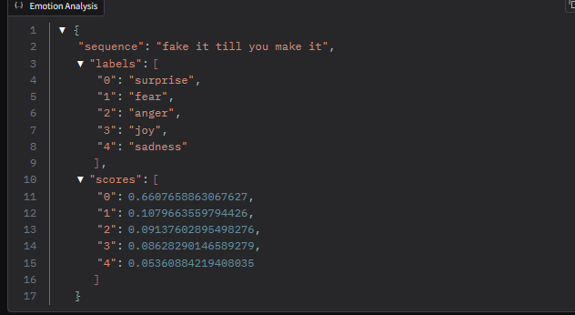
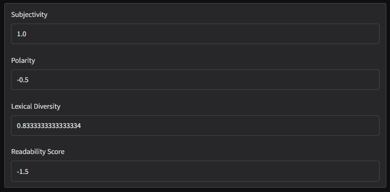
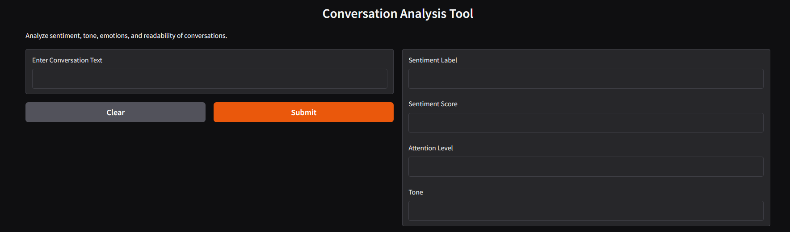
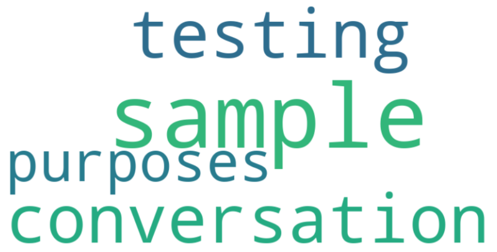

# Docors-Patient-Conversation Analysis Project

This project demonstrates a comprehensive pipeline for analyzing conversations using Natural Language Processing (NLP) techniques. The analysis includes sentiment detection, emotion classification, named entity recognition (NER), readability scoring, lexical diversity computation, and visualization using word clouds.

## Table of Contents

1. [Project Overview](#project-overview)
2. [Features](#features)
3. [Setup Instructions](#setup-instructions)
4. [Usage](#usage)
5. [Outputs](#outputs)
6. [DASHBOARD](#DASHBOARD)
7. [Visualizations](#Visualizations)

---

## Project Overview

This project processes conversation data to extract meaningful insights. It uses Python libraries such as `spacy`, `textblob`, `gradio`, and `transformers` to:

- Analyze sentiment and emotions in text.
- Perform named entity recognition (NER).
- Compute metrics like subjectivity, polarity, lexical diversity, and readability.
- Generate word cloud visualizations for better comprehension of text.
- Provide an interactive Gradio interface for user interaction.

---

## Features

- **Sentiment Analysis:** Determines whether the sentiment is positive, negative, or neutral.
- **Emotion Detection:** Detects specific emotions such as joy, anger, sadness, etc.
- **Named Entity Recognition:** Identifies and classifies entities like names, dates, and locations in text.
- **Lexical Diversity:** Measures the variety of vocabulary used.
- **Readability Scoring:** Computes the Flesch-Kincaid grade level for input text.
- **Word Cloud Generation:** Visualizes the most frequently occurring words.
- **Interactive Gradio Interface:** Allows users to input text and view analysis results interactively.

---

## Setup Instructions

1. **Clone the Repository:**
   ```bash
   git clone [<repository_url>](https://github.com/svnmurali-2004/Docors-Patient-Conversations-Analysis)
   cd Docors-Patient-Conversations-Analysis 
   ```

2. **Install Dependencies:**
   Ensure you have Python installed, then run:
   ```bash
   pip install -r requirements.txt
   ```

   Example dependencies:
   ```
   spacy
   pandas
   textstat
   textblob
   wordcloud
   matplotlib
   transformers
   gradio
   ```

3. **Download NLP Models:**
   Download the necessary models for `spacy`:
   ```bash
   python -m spacy download en_core_web_sm
   ```

4. **Verify Installation:**
   Run a small test script to ensure everything is installed correctly.

---

## Usage

### Input Data
The project accepts a CSV file containing text data. Example file: `gpt-4.csv`.

1. **Load the Data:**
   ```python
   import pandas as pd
   df = pd.read_csv("/content/gpt-4.csv")
   print(df.head())
   ```

2. **Analyze a Conversation:**
   Use the `analyze_text` function to process a single conversation text.
   ```python
   conversation = df.iloc[0, 0]  # Fetch first row text
   analysis = analyze_text(conversation)
   print(analysis)
   ```

---

## Outputs





### Analysis Results

- **Sentiment:** Positive/Negative/Neutral sentiment with a confidence score.
- **Attention Level:** High or Low based on sentiment confidence.
- **Tone:** Reassuring, Concerned, or Neutral based on sentiment.
- **Named Entities:** List of entities and their types (e.g., PERSON, DATE).
- **Emotions:** Ranked probabilities for emotions like joy, anger, sadness, etc.
- **Subjectivity:** Score indicating how subjective the text is (0 to 1).
- **Polarity:** Score indicating sentiment polarity (-1 to 1).
- **Lexical Diversity:** Fraction of unique words in the text.
- **Readability Score:** Flesch-Kincaid grade level.
---

## Interactive Gradio Interface

An interactive interface is provided using Gradio to allow users to analyze conversations effortlessly. The interface includes:

- Text input for conversation data.
- Outputs for:
  - Sentiment label and score.
  - Attention level.
  - Tone.
  - Named entities.
  - Emotion analysis in JSON format.
  - Subjectivity and polarity scores.
  - Lexical diversity.
  - Readability score.
  - Word cloud visualization.

## DASHBOARD


## Visualizations
### Word Cloud 


---

